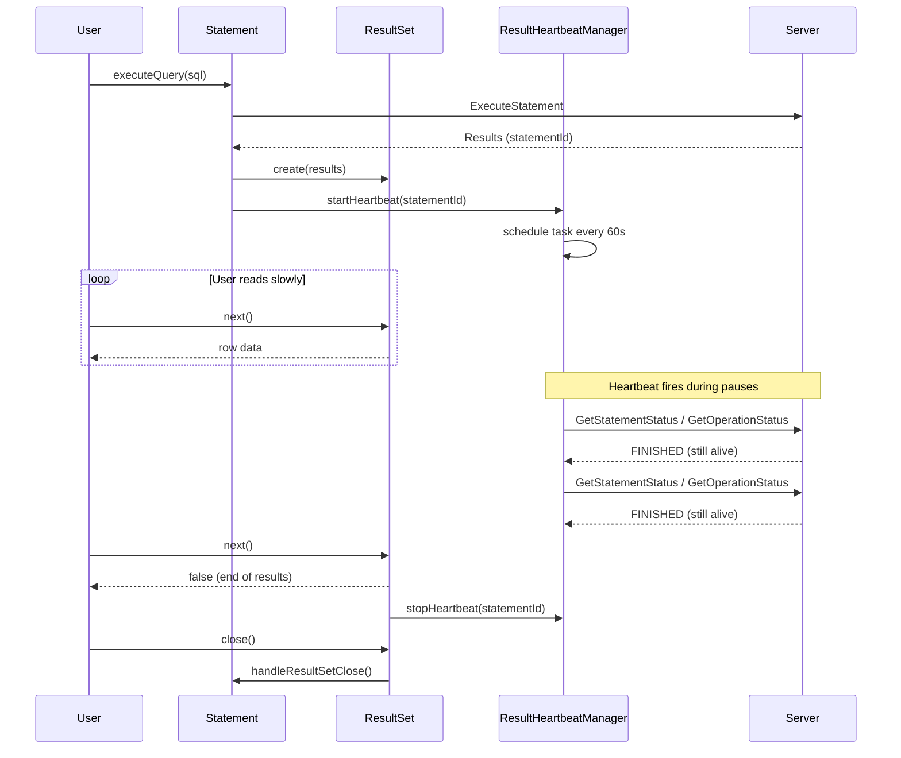
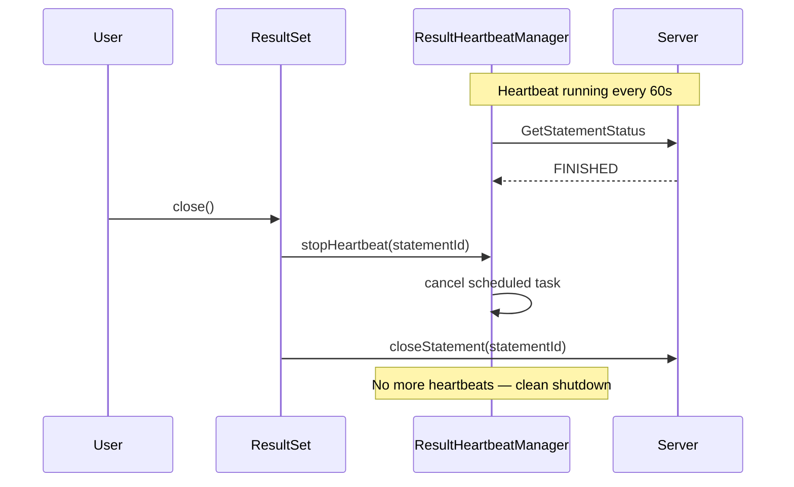
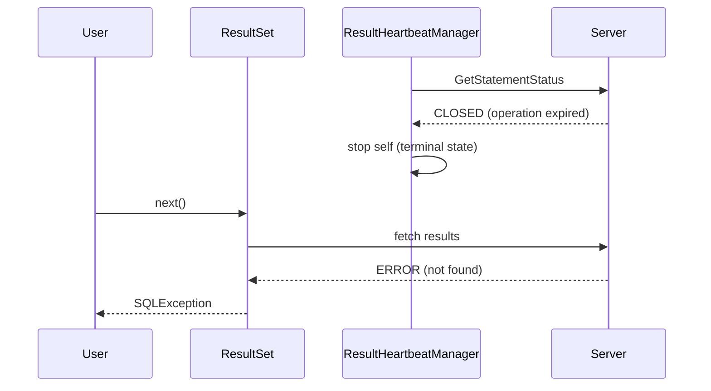
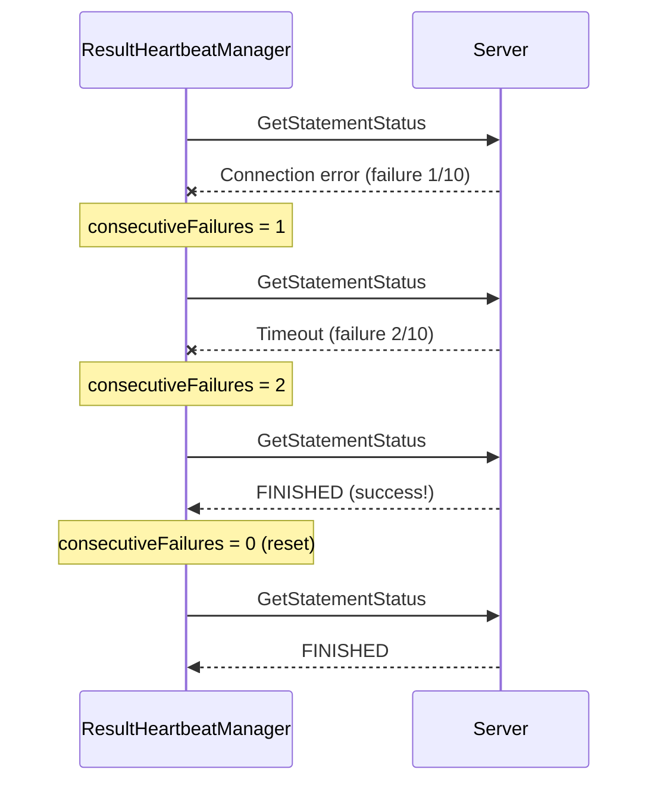
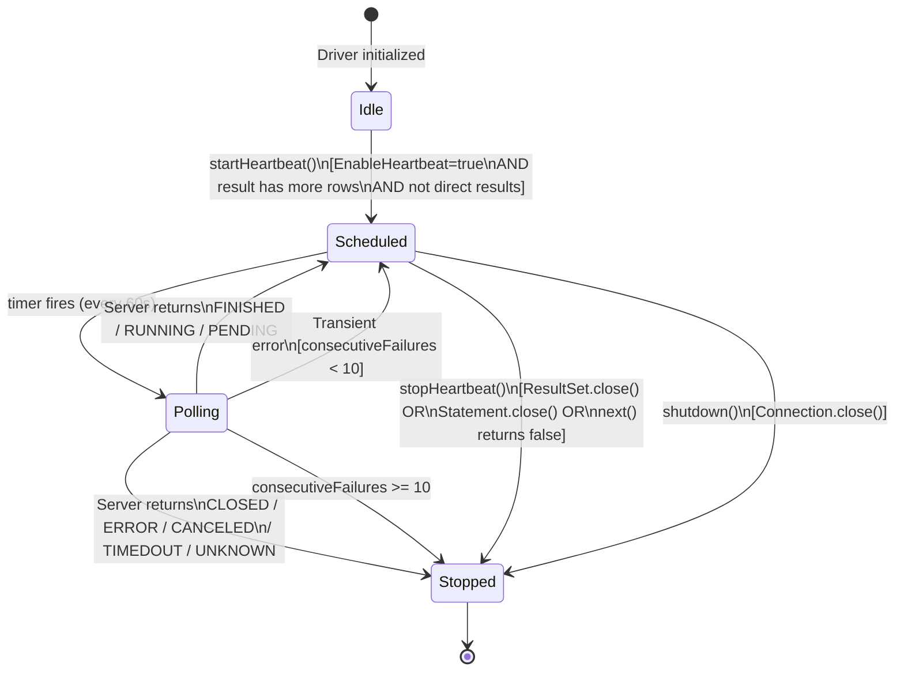
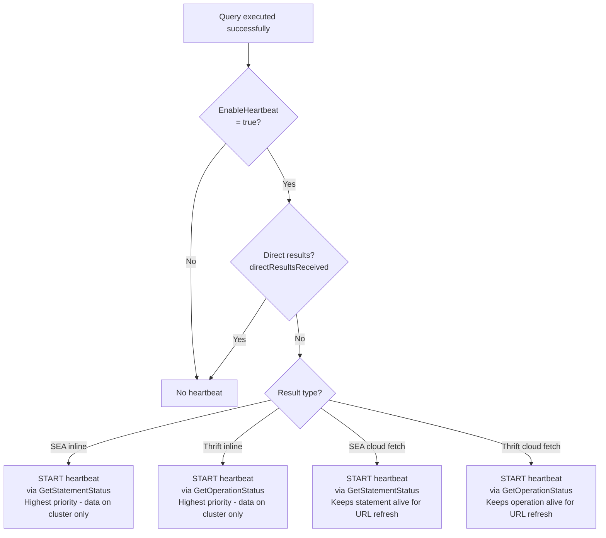
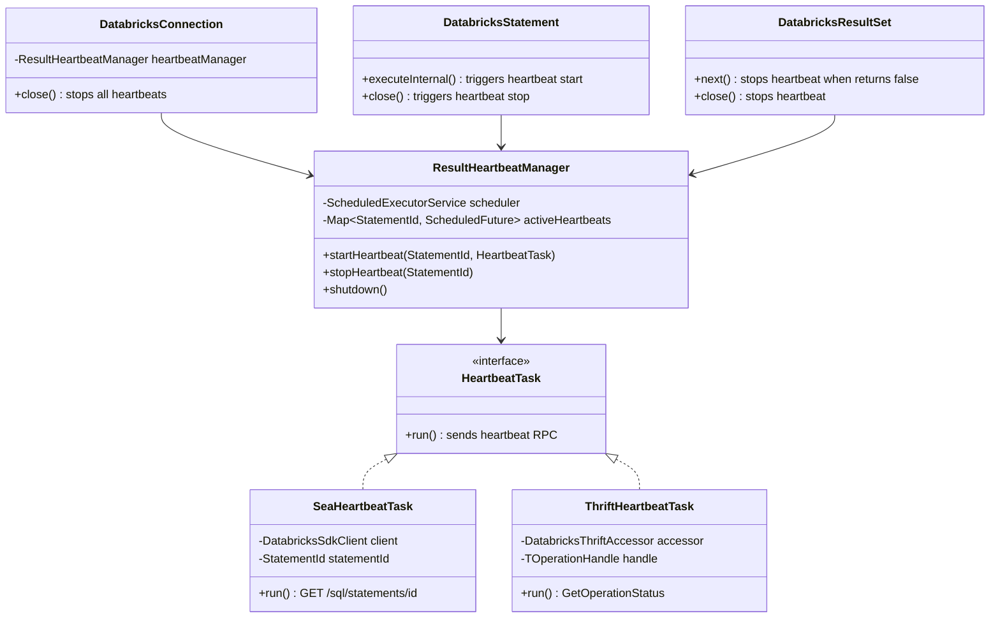

# Design: Result Set Heartbeat / Keep-Alive for Ongoing Query Executions

**JIRA:** PECOBLR-2321
**Author:** Gopal Lal
**Date:** 2026-04-21
**Status:** DRAFT

---

## Problem Statement

When a user executes a query and reads results slowly (e.g., processes each row with pauses of minutes or hours), the server-side resources backing those results can expire:

1. **Warehouse auto-stop**: The cluster shuts down after its configured idle timeout (e.g., 10-60 minutes of no activity), destroying any in-memory state
2. **Operation handle expiry**: The server evicts idle operations after a timeout
3. **Inline result loss**: For inline results (data returned directly in the execute response, not uploaded to cloud storage), the data exists only on the cluster — when the cluster stops, the results are permanently lost
4. **Presigned URL expiry**: Cloud fetch URLs expire in 5-15 minutes (refreshable via re-fetch, but requires the operation to still be alive)

The user sees errors like `INVALID_HANDLE_STATUS`, connection timeouts, or "operation not found" when they attempt to read the next row after a pause.

## Requirements

1. **Keep results alive**: Periodically signal the server that the client is still consuming results, preventing premature resource cleanup
2. **Minimize cost impact**: Heartbeats keep the warehouse running, which costs money. Must be opt-in or clearly documented, and stopped immediately when no longer needed
3. **Zero resource leaks**: Heartbeat tasks must stop when results are fully consumed, ResultSet is closed, Statement is closed, or Connection is closed — any leak means the customer pays for an idle cluster indefinitely
4. **Both protocols**: Work for both SEA (SQL Execution API) and Thrift execution paths
5. **Configurable**: Users can enable/disable the feature and control the interval
6. **Inline results priority**: Most critical for inline results where data is not persisted to cloud storage

## Non-Goals

- Extending the 1-hour result data retention limit in the SEA API (this is a server-side hard limit that cannot be extended by client polling)
- Implementing full result materialization to client-side storage
- Changing server-side timeout configurations

---

## Background: What Keeps Results Alive?

### SEA (SQL Execution API)

- **Statement keep-alive**: Polling via `GET /api/2.1/sql/statements/{id}` keeps the statement alive. The API documentation states: "To guarantee that the statement is kept alive, you must poll at least once every 15 minutes."
- **Result retention**: Results are available for **1 hour** after the query succeeds. Polling does NOT extend this. This is a hard server-side limit.
- **Presigned URLs**: External link URLs expire in <= 15 minutes but can be refreshed by calling `GetStatementResultChunkN`.

### Thrift (HiveServer2 protocol)

- **Operation keep-alive**: The server maintains `lastAccessTime` for each operation. `FetchResults` RPCs constitute activity and reset the idle timer. `GetOperationStatus` may or may not reset it depending on server configuration.
- **Idle operation timeout**: Configured server-side (typically 5 minutes to 1 day). Operations in terminal state (FINISHED) are subject to eviction.

### What Currently Happens

The driver has **no background heartbeat**. Result fetching is demand-driven:
- `ResultSet.next()` triggers the next fetch (Thrift `FetchResults` or SEA chunk download)
- If the user pauses between `next()` calls longer than the server timeout, the operation expires
- For cloud fetch results, the `StreamingChunkProvider` prefetches chunks in the background, which acts as implicit heartbeat — but only while there are unfetched chunks
- For inline results, there is no background activity at all after the initial response

---

## Industry Patterns

### Cross-Driver Survey

Research across Databricks' own driver ecosystem and open-source analytical JDBC drivers:

| Driver | Heartbeat During Result Consumption? | API Called | Default Interval | Configurable? |
|--------|--------------------------------------|-----------|-----------------|---------------|
| **Databricks ADBC (C#)** | **YES** | `GetOperationStatus` (Thrift) | 60s | Yes: `adbc.databricks.fetch_heartbeat_interval` |
| **Databricks Python** | No | N/A | N/A | N/A |
| **Databricks Go** | No | N/A | N/A | N/A |
| **Databricks Node.js** | No | N/A | N/A | N/A |
| **Databricks JDBC (this driver)** | No | N/A | N/A | N/A |

### Reference Implementation: Databricks ADBC C# Driver

The ADBC C# driver (`adbc-drivers/databricks`) is the **only** Databricks driver with a heartbeat. Key design details:

- **Class**: `DatabricksOperationStatusPoller` implementing `IOperationStatusPoller`
- **Protocol**: Thrift only (no SEA equivalent)
- **RPC**: `TCLIService.GetOperationStatus(TGetOperationStatusReq)` — lightweight status check
- **Default interval**: 60 seconds, configurable via `adbc.databricks.fetch_heartbeat_interval`
- **Request timeout**: 30 seconds per poll, configurable via `adbc.databricks.operation_status_request_timeout`
- **Mechanism**: `Task.Run()` with async loop + `CancellationTokenSource` for clean shutdown
- **Started**: In `DatabricksCompositeReader` constructor when `HasMoreRows` is true or unknown
- **Stopped**: On end of results (null batch), Dispose, terminal state, max failures, or cancellation
- **Error resilience**: Max 10 consecutive failures (~10 min at default interval) before self-stop; single success resets counter
- **Terminal states**: CANCELED, ERROR, CLOSED, TIMEDOUT, UNKNOWN → stop polling
- **FINISHED state**: Continues polling (operation complete but client still reading)
- **No disable toggle**: Must set large interval as workaround
- **No SEA support**: REST API path does not implement heartbeat

**Key lessons from the reference implementation:**
1. The heartbeat is Thrift-only — the SEA API has different lifecycle semantics
2. Error resilience is critical — a single transient error (e.g., TLS recycling) should not permanently kill the heartbeat (fixed in their PR #372 after a customer incident)
3. The heartbeat continues even after the query is FINISHED — the goal is to keep the operation handle alive while the client reads results, not to wait for execution
4. No explicit disable parameter exists — our design should add one since heartbeats have cost implications

### General Industry Patterns

| Pattern | Adoption | Effectiveness | This Driver |
|---------|----------|--------------|-------------|
| **Demand-driven fetch (implicit heartbeat)** | Universal | Works only while chunks remain to fetch | Already implemented via `StreamingChunkProvider` |
| **Background heartbeat polling** | One driver (ADBC C#) | Keeps operation alive during slow consumption | Not implemented |
| **Eager cloud storage prefetch** | Universal for cloud fetch | Results survive cluster stop (data in cloud) | Already implemented |
| **Result materialization to client disk** | None found | Would solve the problem completely | Too complex, memory/disk concerns |

---

## Design

### Sequence Diagram: Normal Flow (Happy Path)



### Sequence Diagram: Close During Slow Consumption



### Sequence Diagram: Server-Side Expiry



### Sequence Diagram: Transient Errors with Recovery



### Heartbeat State Machine



### Result Type Eligibility



### Component Architecture



### New Component: `ResultHeartbeatManager`

A lightweight manager that schedules periodic heartbeat RPCs for active result sets.

```java
/**
 * Schedules periodic heartbeat RPCs to keep server-side result state alive
 * while the client is consuming results slowly. Uses a shared
 * ScheduledExecutorService (daemon threads) to minimize resource overhead.
 */
class ResultHeartbeatManager {

    private final ScheduledExecutorService scheduler;  // shared across connection
    private final Map<StatementId, ScheduledFuture<?>> activeHeartbeats;

    /** Start heartbeat for a statement. Called after successful execution. */
    void startHeartbeat(StatementId id, HeartbeatTask task);

    /** Stop heartbeat for a statement. Called on ResultSet.close(), Statement.close(),
     *  or when all results have been fetched. */
    void stopHeartbeat(StatementId id);

    /** Stop all heartbeats. Called on Connection.close(). */
    void shutdown();
}
```

### Heartbeat Task

The heartbeat task is protocol-specific:

**SEA**: `GetStatementStatus` — `GET /api/2.1/sql/statements/{statementId}` (lightweight status check, already implemented in `DatabricksSdkClient` line 276-280). The API documentation states: "To guarantee that the statement is kept alive, you must poll at least once every 15 minutes." This makes heartbeat particularly valuable for SEA.

**Thrift**: `GetOperationStatus(operationHandle)` (lightweight status check, already implemented in `DatabricksThriftAccessor.getOperationStatus()`)

The task:
1. Sends the status check RPC
2. If the server responds with a terminal state (CLOSED, ERROR, CANCELED, TIMEDOUT, UNKNOWN), stops the heartbeat and logs a warning
3. If the server responds with FINISHED state, **continues** polling (operation complete but client still reading)
4. If the RPC fails (connection error, timeout), increments a consecutive failure counter. After **10 consecutive failures** (~10 minutes at default interval), stops the heartbeat. A single success resets the counter. (Learned from ADBC C# PR #372 — a single transient error like TLS recycling should not permanently kill the heartbeat)
5. Does NOT throw exceptions — failures are logged, not propagated to the user's thread

### When Heartbeat Starts and Stops

The heartbeat only starts **after** the main thread's execution polling completes and the ResultSet is constructed. During query execution, the driver's own polling loop (200ms interval) keeps the operation alive — the heartbeat is not needed and does not run during this phase.

```
Execution phase (driver polls):        Result consumption phase (heartbeat polls):
  executeQuery()                         rs = getResultSet()
    → client.executeStatement()          heartbeat starts ──────────────┐
      → poll every 200ms ──────────┐                                    │
      ← SUCCEEDED                  │     rs.next() ... pause ...        │ heartbeat 60s
    ← ResultSet created ───────────┘     rs.next() ... pause ...        │ heartbeat 60s
                                         rs.close() ───────────────────┘ heartbeat stops
```

### Async Execution: No Heartbeat During Wait

For `executeAsync()`, the user controls polling via `getExecutionResult()`. The heartbeat does **not** run between `executeAsync()` and `getExecutionResult()` because:

1. The user opted into async precisely to control timing
2. Automatic heartbeat would keep the warehouse alive even if the user abandoned the query
3. The user has the poll interface — they are responsible for calling `getExecutionResult()` before the statement expires

The heartbeat starts only when the ResultSet is available and the user begins consuming results:

```
stmt.executeAsync(sql)         ← returns immediately, no heartbeat
  ... user does other work ...   ← no heartbeat (user's responsibility to poll)
rs = stmt.getExecutionResult() ← ResultSet created, heartbeat starts
rs.next() ... pause ...          ← heartbeat keeps alive
rs.close()                       ← heartbeat stops
```

### Lifecycle

```
Statement.execute() / getExecutionResult()
    └─▶ ResultSet created
         └─▶ If heartbeat enabled AND result type is eligible:
              startHeartbeat(statementId, heartbeatTask)

ResultSet.next() returns false (all results consumed)
    └─▶ stopHeartbeat(statementId)

ResultSet.close()
    └─▶ stopHeartbeat(statementId)

Statement.close()
    └─▶ stopHeartbeat(statementId)  // safety net

Connection.close()
    └─▶ heartbeatManager.shutdown()  // kills all heartbeats
```

### Which Result Types Need Heartbeat?

| Result Type | Cloud Persisted? | Needs Heartbeat? | Reason |
|-------------|-----------------|-------------------|--------|
| SEA inline (JSON) | No | **No** | All data loaded into memory at construction (InlineJsonResult) |
| SEA cloud fetch (Arrow) | Yes | **Yes** | Statement must stay alive for URL refresh |
| Thrift inline (columnar) | No | **Yes** | Data fetched on-demand from server; server can evict |
| Thrift cloud fetch | Yes | **Yes** | Operation handle must stay alive for URL refresh |
| Direct results (CLOSED state) | N/A | **No** | Server already closed the operation; data fully delivered |
| Update count (DML) | N/A | **No** | No result rows; execution polling already kept it alive |

### Note: Cloud Fetch Prefetch Interaction

For cloud fetch result types (SEA Arrow, Thrift cloud fetch), the `StreamingChunkProvider` and `RemoteChunkProvider` already make background RPCs to download chunks and refresh presigned URLs. These background fetches act as an **implicit heartbeat** — each `FetchResults` or `GetStatementResultChunkN` RPC constitutes server activity.

When both the prefetch threads and the explicit heartbeat are active, the heartbeat is technically redundant. However, we still enable it for cloud fetch because:
1. The prefetch threads stop once all chunks are downloaded — the heartbeat continues during the gap between "all chunks downloaded" and "user finishes reading"
2. If the prefetch is paused (e.g., sliding window full, waiting for user to consume), the heartbeat fills the gap
3. The heartbeat cost is minimal (one lightweight GET/status check per minute)

### Configuration

New connection parameters:

| Parameter | Type | Default | Description |
|-----------|------|---------|-------------|
| `EnableHeartbeat` | boolean | `false` | Enable periodic heartbeat for active result sets |
| `HeartbeatIntervalSeconds` | int | `60` | Interval between heartbeat RPCs (aligned with ADBC C# default) |
| `HeartbeatRequestTimeoutSeconds` | int | `30` | Timeout for each heartbeat RPC |

Default is **disabled** because:
- Heartbeats keep the warehouse running, increasing cost
- Most users consume results quickly
- Cloud fetch results already survive cluster stop
- Users who know they'll read slowly can opt in

**Design choice: explicit disable toggle.** The ADBC C# driver has no way to disable the heartbeat (must set a large interval as workaround). We add `EnableHeartbeat` as an explicit boolean for clarity — cost implications should be a conscious opt-in decision.

### Thread Management

Follows existing codebase patterns:

- **Shared `ScheduledExecutorService`** per connection (like `TelemetryClient`)
- **Daemon threads** (won't prevent JVM shutdown)
- **Named thread factory**: `databricks-jdbc-heartbeat-{connectionId}`
- **Single thread**: heartbeats are lightweight; one thread handles all active result sets for a connection
- **Cleanup order**: ResultSet.close() → stopHeartbeat → (if last) scheduler stays alive for reuse → Connection.close() → scheduler.shutdown()

### Cleanup Guarantees (Zero Leak)

The heartbeat is stopped in **four** places to guarantee no leaks:

1. **All results consumed**: `ResultSet.next()` returns false → stop
2. **ResultSet.close()**: explicit user close → stop
3. **Statement.close()**: closes ResultSet → triggers #2 → stop
4. **Connection.close()**: `heartbeatManager.shutdown()` → cancels ALL heartbeats

Additionally:
- If the heartbeat RPC itself fails (server gone, operation expired), the heartbeat self-stops
- Daemon threads ensure JVM can exit even if cleanup is missed
- `ScheduledFuture.cancel(false)` is used (does not interrupt running heartbeat, waits for current one to finish)

### Error Handling

| Scenario | Behavior |
|----------|----------|
| Heartbeat RPC returns CLOSED/ERROR state | Stop heartbeat, log warning at INFO level |
| Heartbeat RPC fails (network error) | Retry once after 30s; if still fails, stop heartbeat, log warning |
| Heartbeat RPC returns success | Continue scheduling next heartbeat |
| ResultSet.close() called during heartbeat RPC | `cancel(false)` waits for RPC to finish, then stops |
| Connection.close() with active heartbeats | `scheduler.shutdownNow()` interrupts all |

---

## Implementation Plan

### Phase 1: Core Infrastructure

1. **`ResultHeartbeatManager`**: Shared per-connection manager with start/stop/shutdown
2. **`HeartbeatTask` interface**: Protocol-specific implementations for SEA and Thrift
3. **Connection parameters**: `EnableHeartbeat`, `HeartbeatIntervalSeconds`
4. **Integration points**: Hook into `DatabricksResultSet` constructor, `close()`, and `next()` return-false path

### Phase 2: Protocol Implementation

5. **SEA heartbeat**: `DatabricksSdkClient.getStatementStatus(statementId)` — lightweight GET
6. **Thrift heartbeat**: `DatabricksThriftAccessor.getOperationStatus(operationHandle)` — lightweight RPC
7. **Direct results skip**: No heartbeat when `directResultsReceived` is true

### Phase 3: Testing

8. **Unit tests**: Verify lifecycle (start, stop on close, stop on all-consumed, stop on error)
9. **Integration tests**: Verify heartbeat keeps results alive across a simulated pause
10. **Leak tests**: Verify no threads leak after ResultSet/Statement/Connection close

### Phase 4: Documentation

11. **Connection parameter docs**: Document `EnableHeartbeat` and `HeartbeatIntervalSeconds`
12. **Cost implications**: Document that heartbeats keep the warehouse running

---

## Alternatives Considered

### 1. Eager Full Prefetch to Client Memory

Fetch all results into client memory immediately after execution, eliminating server dependency.

**Rejected**: Would cause OOM for large result sets. The existing sliding-window prefetch is the right balance.

### 2. Result Materialization to Client Disk

Write results to local disk as they arrive, serving reads from disk.

**Rejected**: Adds significant complexity (disk management, temp file cleanup, serialization format). No industry precedent in JDBC drivers.

### 3. Force Cloud Fetch for All Queries

Configure the server to always upload results to cloud storage, even for small queries.

**Rejected**: Server-side change outside driver's control. Would add latency for small queries.

### 4. Heartbeat at HTTP Connection Level

Use TCP keepalive or HTTP-level ping to keep the connection alive.

**Rejected**: HTTP keepalive keeps the TCP connection alive, but does NOT keep the server-side operation/statement alive. The problem is application-layer resource expiry, not connection expiry.

---

## Open Questions

1. **Does `GetOperationStatus` reset the Thrift idle operation timer?** The ADBC C# driver uses `GetOperationStatus` for its heartbeat and it works in production (customers confirmed). Need to verify with the server team whether this is guaranteed behavior or implementation-dependent.

2. **Should heartbeat be enabled by default for inline results?** Since inline results are the most vulnerable and the feature is explicitly designed for this case, it might make sense to auto-enable when the result type is inline. But this increases cost without user opt-in. The ADBC C# driver always enables it (no toggle) — we chose to make it opt-in.

3. **SEA heartbeat included (unlike ADBC C#).** The ADBC C# driver only implements Thrift heartbeat. We include SEA heartbeat via `GetStatementStatus` because the API documentation explicitly requires polling every 15 minutes to keep the statement alive. The 1-hour result retention is a hard limit that heartbeat cannot extend, but keeping the statement alive is still valuable for URL refresh and metadata access. Our default 60s interval satisfies the 15-minute requirement with ample margin.

4. **Should we expose a callback for heartbeat failures?** When the heartbeat detects that results have expired (terminal state from server), should we proactively set an error flag so the next `ResultSet.next()` throws a clear error instead of waiting for the fetch to fail with a cryptic server error?

5. **Alignment with ADBC C# driver parameters.** The ADBC C# driver uses `adbc.databricks.fetch_heartbeat_interval`. Should we align our JDBC parameter names for cross-driver consistency (e.g., `FetchHeartbeatIntervalSeconds`) or use our own convention (`HeartbeatIntervalSeconds`)?
