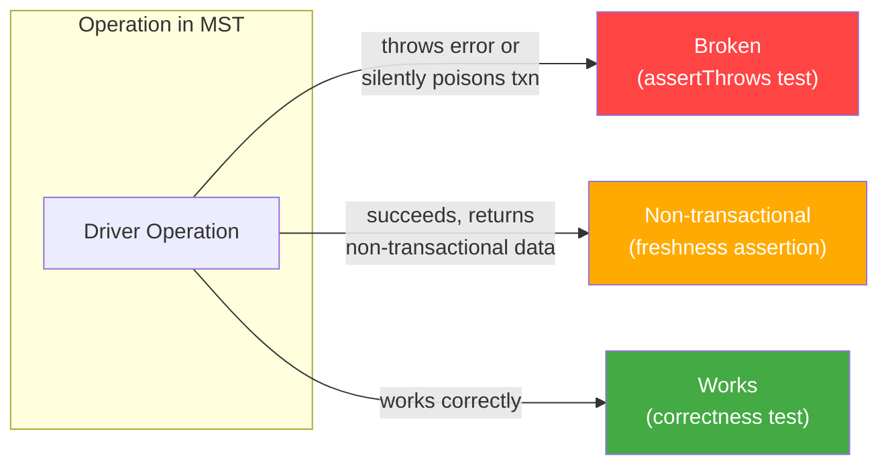
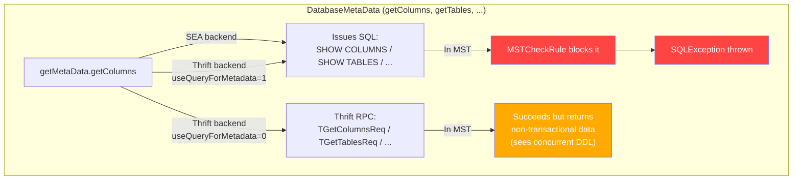
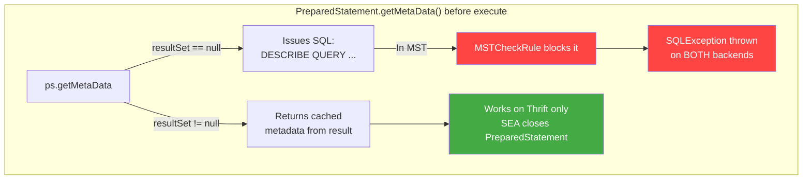
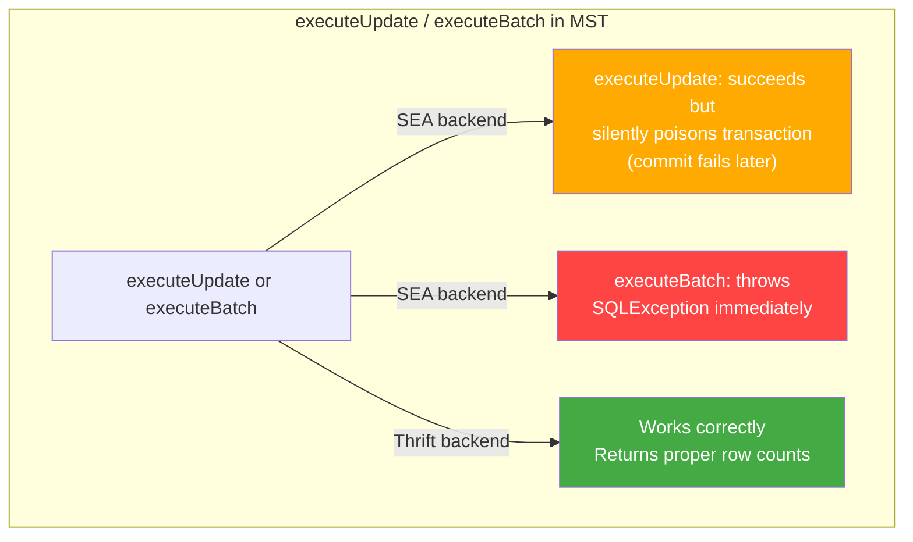
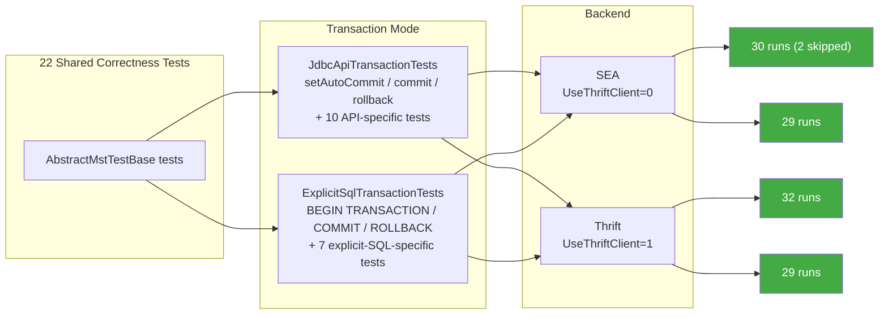
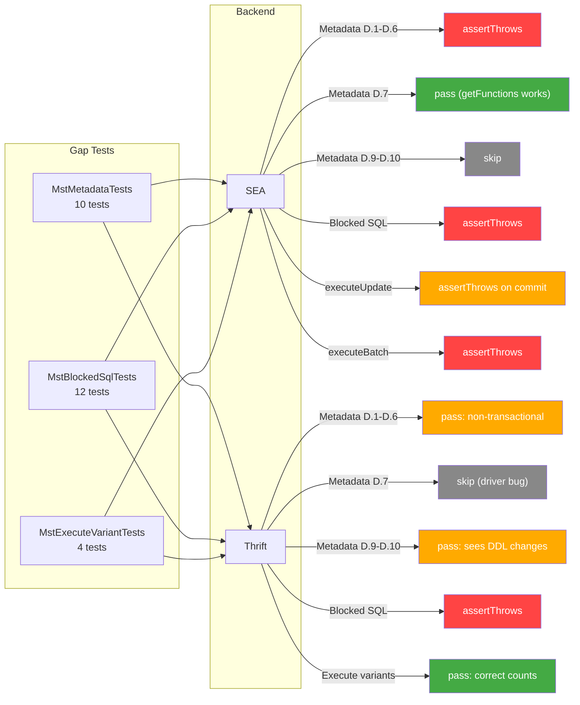
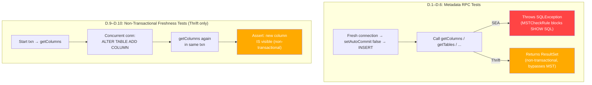
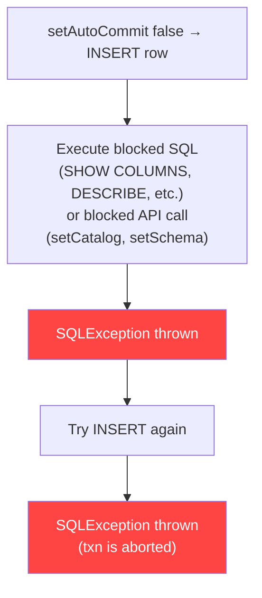
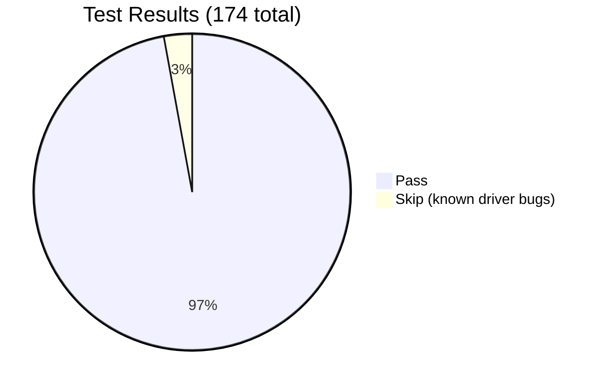

# MST Transaction Test Design

## Context

Multi-Statement Transactions (MST) interact with many JDBC driver code paths differently depending on the backend (SEA vs Thrift). Several server-side bugs (LC-13424, LC-13425, LC-13427, LC-13428) cause operations to either **break** (throw errors) or return **non-transactional data** inside transactions. This test suite provides comprehensive coverage so the server team can validate fixes as they land.

Reference: [MST + xDBC Metadata RPCs audit](https://docs.google.com/document/d/1WSX5imeH8lwiWB6hrKJbL-D6iROxZ7EPWhdxzu-ObTo/edit)

## Operation Categorization

Every driver operation that touches MST falls into one of three buckets:



### How operations route through the driver

The same JDBC method can take completely different code paths depending on the backend:







### Broken (throws error or silently poisons transaction)

| Operation | SEA | Thrift | Bug |
|---|---|---|---|
| `getColumns()` | Broken — issues `SHOW COLUMNS`, blocked by MSTCheckRule | Non-transactional (see below) | LC-13425 |
| `getTables()` | Broken — issues `SHOW TABLES`, blocked | Non-transactional | LC-13425 |
| `getSchemas()` | Broken — issues `SHOW SCHEMAS`, blocked | Non-transactional | LC-13425 |
| `getCatalogs()` | Broken — issues `SHOW CATALOGS`, blocked | Non-transactional | LC-13425 |
| `getPrimaryKeys()` | Broken | Broken — server routes `TGetPrimaryKeysReq` through GET_FUNCTIONS which is blocked in MST | LC-13425 |
| `getCrossReference()` | Broken | Non-transactional | LC-13425 |
| `getFunctions()` | **Works** — `SHOW FUNCTIONS IN CATALOG` with `StatementType.METADATA` is not blocked | Non-transactional (driver logging bug: `IllegalFormatConversionException`) | |
| `PreparedStatement.getMetaData()` before execute | Broken — issues `DESCRIBE QUERY` SQL | Broken — same path, issues SQL | LC-13425 |
| `PreparedStatement.getMetaData()` after execute | **Broken** — SEA closes PreparedStatement after execute | Works — returns cached metadata | |
| PreparedStatement reuse across txns | **Broken** — SEA closes PreparedStatement after execute | Works | |
| `setCatalog()` | Broken — `SET CATALOG` blocked in MST | Broken — same | |
| `setSchema()` | Broken — `USE SCHEMA` blocked in MST | Broken — same | |
| `executeUpdate()` / `executeLargeUpdate()` | Succeeds but **silently poisons** txn — commit fails | Works correctly | LC-13424 |
| `executeBatch()` / `PreparedStatement.executeBatch()` | **Broken** — throws SQLException, aborts txn | Works correctly | LC-13424 |
| All SHOW/DESCRIBE/information_schema SQL | Broken — MSTCheckRule | Broken — MSTCheckRule | LC-13425 |

### Non-transactional (succeeds but bypasses transaction isolation)

| Operation | Backend | E2E Verified Behavior |
|---|---|---|
| `getColumns()`, `getTables()`, `getSchemas()`, `getCatalogs()`, `getPrimaryKeys()`, `getCrossReference()` via Thrift RPC | Thrift (default) | Thrift RPCs bypass MST context. They query the metastore directly and **see concurrent DDL changes** (e.g., `ALTER TABLE ADD COLUMN` from another connection is immediately visible). This violates transaction isolation — the transaction should see a consistent snapshot. |
| `getFunctions()` via Thrift RPC | Thrift | Returns results but triggers a **driver logging bug** (`IllegalFormatConversionException` in format string). Test skipped. |

### Works (test for correctness)

Basic DML (`execute`, `executeQuery`), commit/rollback, isolation, error handling, connection lifecycle, `getParameterMetaData()`.

## Implementation Details

### SEA Statement Lifecycle

A critical finding during E2E: **SEA backend auto-closes Statement and PreparedStatement objects after each `execute()` call**. This affects test design:

- Cannot reuse a `Statement` for multiple `execute()` calls — use `executeSql()` helper that creates a fresh Statement per call
- Cannot reuse a `PreparedStatement` across transaction boundaries
- Cannot call `PreparedStatement.getMetaData()` after `execute()` — the PreparedStatement is already closed

```java
// Helper: creates fresh Statement per call (required for SEA)
protected void executeSql(Connection conn, String sql) throws SQLException {
    try (Statement stmt = conn.createStatement()) {
        stmt.execute(sql);
    }
}
```

### Parallel Execution

Each test class uses a **unique table name** based on its class name to allow parallel execution without Delta table version conflicts:

```java
String suffix = getClass().getSimpleName().toLowerCase();
this.testTable = "mst_" + suffix + "_t1";
this.testTable2 = "mst_" + suffix + "_t2";
```

## Test Architecture

### Class Hierarchy

```mermaid
classDiagram
    class AbstractMstTestBase {
        <<abstract>>
        #Connection connection
        #int useThrift
        #String testTable
        #String testTable2
        +initBackend(int useThrift) void
        +cleanup() void
        #startTransaction(Connection)* void
        #commitTransaction(Connection)* void
        #rollbackTransaction(Connection)* void
        #executeSql(Connection, String) void
        #isSEA() boolean
        #isThrift() boolean
        +testCommitSingleInsert()
        +testRollbackSingleInsert()
        +... 19 more shared tests
    }
    note for AbstractMstTestBase "Parameterized: SEA + Thrift.\n22 shared correctness tests.\nNo @Test annotations —\ninvoked via super.testX()\nfrom parameterized subclasses."

    class JdbcApiTransactionTests {
        #startTransaction() → setAutoCommit false
        #commitTransaction() → connection.commit
        #rollbackTransaction() → connection.rollback
        +testDefaultAutoCommitIsTrue()
        +testAutoStartAfterCommit()
        +testAutoStartAfterRollback()
        +testSetAutoCommitDuringActiveTxnThrows()
        +testUnsupportedIsolationLevel()
        +testSupportedIsolationLevel()
        +testPreparedStatementUpdate()
        +testPreparedStatementReuse() ⚠️
        +testGetMetaDataAfterExecute() ⚠️
        +testGetParameterMetaData()
    }
    note for JdbcApiTransactionTests "10 API-specific tests\n+ inherits 22 shared tests.\n⚠️ = skipped on SEA\n(PreparedStatement closed)"

    class ExplicitSqlTransactionTests {
        #startTransaction() → BEGIN TRANSACTION
        #commitTransaction() → COMMIT
        #rollbackTransaction() → ROLLBACK
        +testNestedBeginTransactionFails()
        +testBeginFailsWhenAutocommitFalse()
        +testSetAutocommitFalseCommit()
        +testSetAutocommitFalseRollback()
        +testSetAutocommitTrue()
        +testSetAutocommitWithoutValue()
        +testSetAutocommitTrueDuringActiveTxnFails()
    }
    note for ExplicitSqlTransactionTests "7 SQL-specific tests\n+ inherits 22 shared tests.\nAll use executeSql() helper\nfor SEA compatibility."

    class MstMetadataTests {
        +testGetColumnsInMst()
        +testGetTablesInMst()
        +testGetSchemasInMst()
        +testGetCatalogsInMst()
        +testGetPrimaryKeysInMst() ⚠️
        +testGetCrossReferenceInMst()
        +testGetFunctionsInMst() ⚠️
        +testGetMetaDataBeforeExecute()
        +testGetColumnsNonTxnAfterDDL()
        +testGetTablesNonTxnAfterDDL()
    }
    note for MstMetadataTests "SEA: assertThrows (blocked)\nThrift: returns results\n(non-transactional)\n⚠️ = known issues\nEach test: own fresh txn."

    class MstBlockedSqlTests {
        +testShowColumnsBlockedInMst()
        +testShowTablesBlockedInMst()
        +... 8 more blocked SQL tests
        +testSetCatalogBlockedInMst()
        +testSetSchemaBlockedInMst()
    }
    note for MstBlockedSqlTests "All assertThrows on\nboth backends.\nVerify exception AND\ntxn abort."

    class MstExecuteVariantTests {
        +testExecuteUpdateRowCount()
        +testExecuteLargeUpdateRowCount()
        +testExecuteBatchRowCounts()
        +testPSExecuteBatchRowCounts()
    }
    note for MstExecuteVariantTests "SEA: executeUpdate poisons txn\n(commit fails). executeBatch\nthrows directly.\nThrift: all work correctly."

    AbstractMstTestBase <|-- JdbcApiTransactionTests
    AbstractMstTestBase <|-- ExplicitSqlTransactionTests
    AbstractMstTestBase <|-- MstMetadataTests
    AbstractMstTestBase <|-- MstBlockedSqlTests
    AbstractMstTestBase <|-- MstExecuteVariantTests
```



### Design Principles

1. **Shared tests are mode-agnostic.** Tests in `AbstractMstTestBase` use `startTransaction()`, `commitTransaction()`, `rollbackTransaction()` — they never call `setAutoCommit()`, `connection.commit()`, `BEGIN TRANSACTION`, etc. directly. The subclass decides the mechanism.

2. **No `@Test` on abstract base class.** JUnit would run them directly on gap test subclasses without initialization. Tests are only invoked via `super.testX()` from parameterized wrappers in subclasses.

3. **API-specific tests live in the subclass that owns the API.**
   - `testDefaultAutoCommitIsTrue`, `testSetAutoCommitDuringActiveTxnThrows`, isolation level tests, PreparedStatement tests → `JdbcApiTransactionTests`
   - `testNestedBeginTransactionFails`, `testBeginFailsWhenAutocommitFalse`, SET AUTOCOMMIT tests → `ExplicitSqlTransactionTests`

4. **ExplicitSqlTransactionTests uses BEGIN TRANSACTION, not SET AUTOCOMMIT**, for the shared tests. SET AUTOCOMMIT tests are special cases that cover the implicit SQL transaction mode.

5. **Gap tests use JDBC API mode** for transaction control (`setAutoCommit(false)`). MSTCheckRule doesn't care how the transaction was started, so we only need one transaction mode for these.

6. **Each metadata test starts its own fresh transaction** to prevent session poisoning from cascading between tests.

### How tests execute across backends and transaction modes



Gap test execution:



### Backend parameterization

Every test class is parameterized with `(useThrift, backendName)`:

```java
static Stream<Arguments> backends() {
    return Stream.of(
        Arguments.of(0, "SEA"),
        Arguments.of(1, "Thrift")
    );
}
```

Individual tests use `Assumptions` to skip when only relevant to one backend:

```java
// Skip on SEA (PreparedStatement closed after execute)
Assumptions.assumeTrue(isThrift(), "SEA closes PreparedStatement after execute");

// Different assertion per backend
if (isSEA()) {
    assertThrows(SQLException.class, () -> dbmd.getColumns(...));
} else {
    ResultSet rs = dbmd.getColumns(...);
    assertTrue(rs.next()); // non-transactional — sees latest metastore state
}
```

## Test Plan

### A. Shared correctness tests (in AbstractMstTestBase)

Run by both JdbcApiTransactionTests and ExplicitSqlTransactionTests, on both SEA and Thrift. All descriptions are mode-agnostic — `startTransaction()` / `commitTransaction()` / `rollbackTransaction()` are provided by the subclass.

| # | Test | Description | Expected |
|---|---|---|---|
| A.1 | `testCommitSingleInsert` | Start txn → INSERT → commit → verify row visible from separate conn | Pass |
| A.2 | `testCommitMultipleInserts` | Start txn → 3 INSERTs → commit → verify all 3 rows | Pass |
| A.3 | `testRollbackSingleInsert` | Start txn → INSERT → rollback → verify not persisted | Pass |
| A.4 | `testMultipleSequentialTransactions` | 3 sequential txns (commit, commit, rollback) → verify only first two persist | Pass |
| A.5 | `testUpdateInTransaction` | Insert with autocommit → start txn → UPDATE → commit → verify updated | Pass |
| A.6 | `testDeleteInTransaction` | Insert 2 rows → start txn → DELETE one → commit → verify 1 remains | Pass |
| A.7 | `testMultiTableCommit` | Start txn → insert into 2 tables → commit → verify both from separate conn | Pass |
| A.8 | `testMultiTableRollback` | Start txn → insert into 2 tables → rollback → verify neither persisted | Pass |
| A.9 | `testMultiTableAtomicity` | Start txn → insert into A → invalid SQL on B → rollback → verify A also rolled back | Pass |
| A.10 | `testCrossTableMerge` | Start txn → MERGE across source/target tables → commit → verify | Pass |
| A.11 | `testRepeatableReads` | Start txn → read → external conn modifies → re-read in txn → same value | Pass |
| A.12 | `testWriteConflictSingleTable` | Two concurrent txns on same table → first commits → second gets ConcurrentAppendException | Pass |
| A.13 | `testWriteSkewProvesSnapshotIsolation` | Two concurrent txns on different tables → both commit → proves Snapshot Isolation | Pass |
| A.14 | `testCommitWithoutActiveTxnThrows` | No active txn → commit → expect exception | Pass |
| A.15 | `testRollbackWithoutActiveTxnBehavior` | No active txn → rollback → JDBC API throws, explicit SQL ROLLBACK is no-op | Pass |
| A.16 | `testCloseConnectionImplicitRollback` | Start txn → insert → close() without commit → verify not persisted from new conn | Pass |
| A.17 | `testCloseConnectionDoesNotThrow` | Start txn → insert → close() → no exception | Pass |
| A.18 | `testEmptyTransactionRollback` | Start txn → rollback immediately → no exception | Pass |
| A.19 | `testReadOnlyTransaction` | Start txn → SELECT-only → commit → data unchanged | Pass |
| A.20 | `testRollbackAfterQueryFailure` | Start txn → insert → invalid SQL → rollback → new txn → insert → commit → verify recovery | Pass |
| A.21 | `testMultipleStatementsInSingleTxn` | Start txn → 3 Statement objects each insert → commit → verify 3 rows | Pass |
| A.22 | `testPreparedStatementInsert` | Start txn → parameterized INSERT → commit → verify | Pass |

### B. JdbcApiTransactionTests — API-specific tests

These use JDBC API methods (`setAutoCommit`, `setTransactionIsolation`, etc.) that only apply to the JDBC API transaction mode. Run on both backends.

| # | Test | Description | SEA | Thrift |
|---|---|---|---|---|
| B.1 | `testDefaultAutoCommitIsTrue` | New connection → assert `getAutoCommit()` returns true | Pass | Pass |
| B.2 | `testAutoStartAfterCommit` | `setAutoCommit(false)` → INSERT → commit → INSERT again (auto-starts new txn) → rollback → only first INSERT persists | Pass | Pass |
| B.3 | `testAutoStartAfterRollback` | `setAutoCommit(false)` → INSERT → rollback → INSERT again (auto-starts new txn) → commit → only second INSERT persists | Pass | Pass |
| B.4 | `testSetAutoCommitDuringActiveTxnThrows` | `setAutoCommit(false)` → INSERT → `setAutoCommit(true)` → expect exception | Pass | Pass |
| B.5 | `testUnsupportedIsolationLevel` | `setTransactionIsolation(READ_UNCOMMITTED/READ_COMMITTED/SERIALIZABLE)` → expect exception for each | Pass | Pass |
| B.6 | `testSupportedIsolationLevel` | `setTransactionIsolation(REPEATABLE_READ)` → `getTransactionIsolation()` → verify | Pass | Pass |
| B.7 | `testPreparedStatementUpdate` | `setAutoCommit(false)` → insert → parameterized UPDATE via `execute()` → commit → verify | Pass | Pass |
| B.8 | `testPreparedStatementReuseAcrossTransactions` | Same PreparedStatement used in txn1 (commit) and txn2 (commit) → verify both rows | **Skip** (SEA closes PS) | Pass |
| B.9 | `testPreparedStatementGetMetaDataAfterExecute` | `setAutoCommit(false)` → execute PreparedStatement SELECT → `getMetaData()` → verify column count | **Skip** (SEA closes PS) | Pass |
| B.10 | `testGetParameterMetaData` | `setAutoCommit(false)` → create parameterized PreparedStatement → `getParameterMetaData()` → verify non-null | Pass | Pass |

### C. ExplicitSqlTransactionTests — SQL-specific tests

These test SQL-level transaction control. The shared tests inherited from `AbstractMstTestBase` use `BEGIN TRANSACTION` / `COMMIT` / `ROLLBACK`. The special tests below cover behavior unique to SQL transaction statements. Run on both backends.

| # | Test | Description | Expected |
|---|---|---|---|
| C.1 | `testNestedBeginTransactionFails` | `BEGIN TRANSACTION` → `BEGIN TRANSACTION` → expect exception | Pass |
| C.2 | `testBeginFailsWhenAutocommitFalse` | `SET AUTOCOMMIT = FALSE` → `BEGIN TRANSACTION` → expect exception (can't use explicit BEGIN in implicit mode) | Pass |
| C.3 | `testSetAutocommitFalseCommit` | `SET AUTOCOMMIT = FALSE` → INSERT → `COMMIT` → verify persisted (tests implicit SQL transaction mode) | Pass |
| C.4 | `testSetAutocommitFalseRollback` | `SET AUTOCOMMIT = FALSE` → INSERT → `ROLLBACK` → verify not persisted | Pass |
| C.5 | `testSetAutocommitTrue` | `SET AUTOCOMMIT = FALSE` → commit → `SET AUTOCOMMIT = TRUE` → INSERT auto-commits → verify | Pass |
| C.6 | `testSetAutocommitWithoutValue` | `SET AUTOCOMMIT` → returns current value → change → query again → different value | Pass |
| C.7 | `testSetAutocommitTrueDuringActiveTxnFails` | `SET AUTOCOMMIT = FALSE` → INSERT → `SET AUTOCOMMIT = TRUE` → expect exception | Pass |

### D. MstMetadataTests — metadata RPCs in MST

Uses JDBC API mode (`setAutoCommit(false)`) for transaction control. Each test starts its own fresh transaction to prevent session poisoning. Run on both backends with backend-aware assertions.



| # | Test | SEA | Thrift |
|---|---|---|---|
| D.1 | `testGetColumnsInMst` | assertThrows (SHOW COLUMNS blocked) | Pass: returns results (non-transactional) |
| D.2 | `testGetTablesInMst` | assertThrows (SHOW TABLES blocked) | Pass: returns results (non-transactional) |
| D.3 | `testGetSchemasInMst` | assertThrows (SHOW SCHEMAS blocked) | Pass: returns results (non-transactional) |
| D.4 | `testGetCatalogsInMst` | assertThrows (SHOW CATALOGS blocked) | Pass: returns results (non-transactional) |
| D.5 | `testGetPrimaryKeysInMst` | assertThrows | assertThrows — server routes through GET_FUNCTIONS, blocked in MST |
| D.6 | `testGetCrossReferenceInMst` | assertThrows | Pass: returns ResultSet |
| D.7 | `testGetFunctionsInMst` | Pass: returns ResultSet (`SHOW FUNCTIONS IN CATALOG` with `StatementType.METADATA` is not blocked) | **Skip**: driver logging bug (`IllegalFormatConversionException`) |
| D.8 | `testPreparedStatementGetMetaDataBeforeExecute` | assertThrows (DESCRIBE QUERY blocked) | assertThrows (same) |
| D.9 | `testGetColumnsNonTxnAfterConcurrentAddColumn` | Skip (would throw) | Assert: new column **IS visible** after concurrent `ALTER TABLE ADD COLUMN` (proves Thrift RPCs bypass transaction isolation) |
| D.10 | `testGetTablesNonTxnAfterConcurrentCreateTable` | Skip | Assert: new table **IS visible** after concurrent `CREATE TABLE` |

### E. MstBlockedSqlTests — SQL introspection blocked by MSTCheckRule

Uses JDBC API mode. Run on both backends. Each test starts a txn via `setAutoCommit(false)`, INSERTs a row, executes the blocked SQL, expects exception, then verifies txn is aborted (subsequent INSERT also throws).



| # | Test | Operation | SEA | Thrift |
|---|---|---|---|---|
| E.1 | `testShowColumnsBlockedInMst` | `SHOW COLUMNS IN <table>` | Pass | Pass |
| E.2 | `testShowTablesBlockedInMst` | `SHOW TABLES IN <schema>` | Pass | Pass |
| E.3 | `testShowSchemasBlockedInMst` | `SHOW SCHEMAS IN <catalog>` | Pass | Pass |
| E.4 | `testShowCatalogsBlockedInMst` | `SHOW CATALOGS` | Pass | Pass |
| E.5 | `testShowFunctionsBlockedInMst` | `SHOW FUNCTIONS` | Pass | Pass |
| E.6 | `testDescribeQueryBlockedInMst` | `DESCRIBE QUERY SELECT * FROM <table>` | Pass | Pass |
| E.7 | `testDescribeTableExtendedBlockedInMst` | `DESCRIBE TABLE EXTENDED <table>` | Pass | Pass |
| E.8 | `testDescribeTableBlockedInMst` | `DESCRIBE TABLE <table>` | Pass | Pass |
| E.9 | `testDescribeColumnBlockedInMst` | `DESCRIBE <table>.<column>` | Pass | Pass |
| E.10 | `testInformationSchemaBlockedInMst` | `SELECT FROM information_schema.columns` | Pass | Pass |
| E.11 | `testSetCatalogBlockedInMst` | `connection.setCatalog()` — JDBC API call | Pass | Pass |
| E.12 | `testSetSchemaBlockedInMst` | `connection.setSchema()` — JDBC API call | Pass | Pass |

### F. MstExecuteVariantTests — execute method variants

Uses JDBC API mode. Backend-aware assertions based on E2E findings.

| # | Test | SEA | Thrift |
|---|---|---|---|
| F.1 | `testExecuteUpdateRowCount` | executeUpdate succeeds but silently poisons txn → assertThrows on commit (LC-13424) | Pass: correct count, commit succeeds |
| F.2 | `testExecuteLargeUpdateRowCount` | Same as F.1 — silently poisons txn | Pass: correct count, commit succeeds |
| F.3 | `testExecuteBatchRowCounts` | assertThrows — executeBatch aborts txn immediately (LC-13424) | Pass: correct counts, commit succeeds |
| F.4 | `testPreparedStatementExecuteBatchRowCounts` | assertThrows — same as F.3 | Pass: correct counts, commit succeeds |

## E2E Results

Final test run results (all 5 suites in parallel):



| Suite | Total | Pass | Skip | Error | Notes |
|---|---|---|---|---|---|
| **MstBlockedSqlTests** | 24 | **24** | 0 | 0 | All clean |
| **MstExecuteVariantTests** | 8 | **8** | 0 | 0 | All clean |
| **ExplicitSqlTransactionTests** | 58 | **58** | 0 | 0 | All clean |
| **JdbcApiTransactionTests** | 64 | **62** | **2** | 0 | 2 SEA skips: PreparedStatement closed after execute |
| **MstMetadataTests** | 20 | **17** | **3** | 0 | 3 skips: D.9 SEA (freshness), D.10 SEA (freshness), D.7 Thrift (driver logging bug) |
| **Total** | **174** | **169** | **5** | **0** | |

### Known Issues (not test bugs)

| Issue | Description | Affected Test |
|---|---|---|
| SEA closes PreparedStatement after execute | Can't reuse PreparedStatement or call getMetaData() after execute on SEA. Violates JDBC spec §13.1.1. | B.8, B.9 (skipped) |
| Thrift getFunctions driver logging bug | `IllegalFormatConversionException` — format string in `JulLogger` applies `%g` specifier to exception object | D.7 Thrift (skipped) |
| `SHOW FUNCTIONS IN CATALOG` not blocked | Unlike bare `SHOW FUNCTIONS`, the `IN CATALOG` variant with `StatementType.METADATA` is not blocked by MSTCheckRule | D.7 SEA (passes — not blocked) |
| `getPrimaryKeys` blocked on both backends | Server routes `TGetPrimaryKeysReq` through GET_FUNCTIONS which is blocked in MST | D.5 (assertThrows on both) |

## Test Counts

| Class | Unique tests | Executions (×2 backends) |
|---|---|---|
| AbstractMstTestBase (via JdbcApiTransactionTests) | 22 shared + 10 API-specific = 32 | 62 (2 SEA skips) |
| AbstractMstTestBase (via ExplicitSqlTransactionTests) | 22 shared + 7 SQL-specific = 29 | 58 |
| MstMetadataTests | 10 | 17 (3 skips) |
| MstBlockedSqlTests | 12 | 24 |
| MstExecuteVariantTests | 4 | 8 |
| **Total** | **65 unique** | **174 executions** |

## Open items

- [ ] Fix SEA PreparedStatement lifecycle — should remain open after execute per JDBC spec (driver bug)
- [ ] File bug for `SHOW FUNCTIONS IN CATALOG` not being blocked by MSTCheckRule (inconsistent with other SHOW commands)
- [ ] File bug for Thrift getFunctions `IllegalFormatConversionException` driver logging issue
- [ ] Python driver test refactoring (separate effort, similar structure but no Thrift/SEA split needed today since Python defaults to Thrift)
